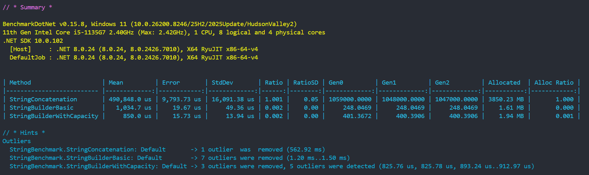

# StringBuilder vs String Concatenation

## Strings

Strings in C# are **immutable**, every += creates a brand new string object on the heap and discards the previous one. In a loop of 10,000 iterations, this means 10,000 allocations the GC has to clean up.

## StringBuilder

StringBuilder keeps an internal char[] buffer. When we call [Append()](https://learn.microsoft.com/en-us/dotnet/api/system.text.stringbuilder.append), it adds characters directly to that buffer instead of creating a new string each time.

If the buffer runs out of space, it automatically grows. Only when we call ToString() do we create the final immutable string from that buffer.

Note: It is possible to set the initial capacity in order to avoid internal resizes

```csharp
var sb = new StringBuilder(capacity: orders.Count * 60);
```


## When to use each

We should use **string interpolation** when we have a fixed, known number of parts (the compiler will optimize it into a single efficient call):

```csharp
string message = $"Hello {name}, your order #{id} is ready.";
```

We should use **StringBuilder** when the number of parts is unknown or very large (loops, dynamic reports, building HTML, CSV, or SQL):

```csharp
var sb = new StringBuilder();
foreach (var order in orders)
{
    sb.AppendLine($"Order #{order.Id} | {order.Customer} | {order.Amount:C}");
}

string result = sb.ToString();
```

## Benchmark results


Besides time, the most important metric is memory allocations, string concatenation allocated **3,850 MB** vs **1.61 MB** with `StringBuilder`, those extra allocations put constant pressure on the GC, which represents a real cost in production.

